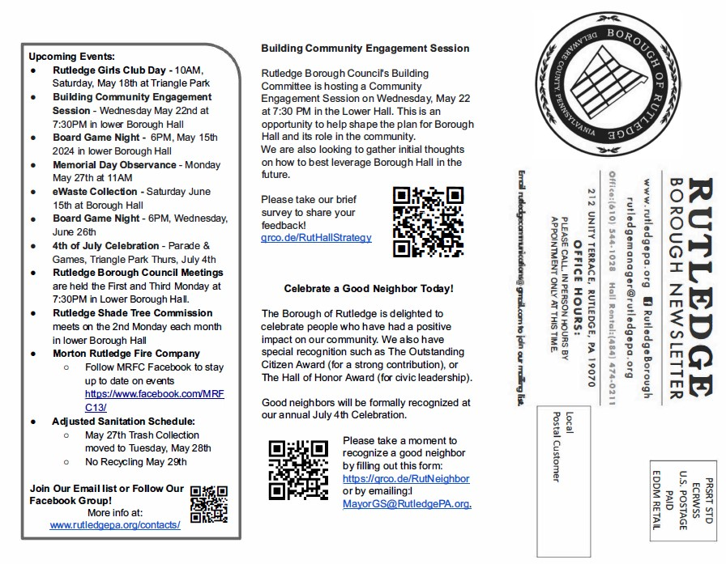
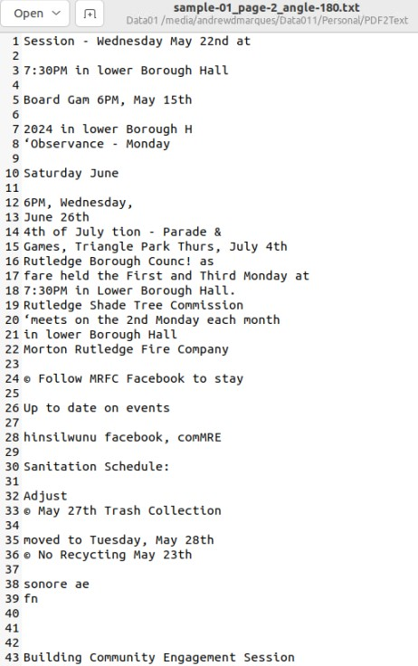

# Rutledge Ordinance Project 2024
## Overview
This repository houses the scripts developed for the codification project of Rutledge Borough, Pennsylvania. The tools here were designed and implemented by Andrew D. Marques, who served as a part-time temporary Clerical Assistant for the Borough of Rutledge. The project's scope spans the collection and organization of borough ordinances passed from 2001 to 2024, facilitating their digital availability.
## Project Objectives
The primary goal of this initiative is to modernize access to municipal legislation, thereby supporting Rutledge Borough in addressing any legislative discrepancies and aligning local laws with those of Delaware County and the State of Pennsylvania. This effort is in collaboration with General Code (eCode360), enhancing the borough’s legal framework for improved governance and public access.
## Impact
The successful implementation of these scripts ensures comprehensive legal transparency but also makes these ordinances accessible to all residents former, present, and future.

# Task-01: Optical Character Recognition to Identify Relevant PDFs

## Summary

### Purpose:
The purpose of this task is to download all contents of the Borough of Rutledge's website and scan all uploaded PDFs for key terms like "Ordinance". This enables us to query for potentially missing ordinances from 2001-2024.

### Method:
METHOD: Python3 is implemented to read in all PDFs from the Borough of Rutledge website and convert the PDFs to text files that are then queried for terms that can identify important information relating to ordinances. A repository from this search can be downloaded at doi: 10.5281/zenodo.14056462

### Results
RESULTS: Scanning the PDF files did not provide any new information. It may be more useful to quiery the existing text files (typically index.html) that have minutes from meetings spanning at least to 2010. 

## Detailed notes

### Features

- **Recursive PDF Search:** Automatically locates and processes all PDF files within the specified input directory, including its subdirectories.
- **Multiple Orientations:** Converts each page of the PDF files into text at 0°, 90°, 180°, and 270° rotations.
- **Logging:** Outputs a CSV file with the list of processed PDFs along with their original locations.
- **Progress Reporting:** Displays real-time processing information and summary statistics upon completion.

### Requirements

- Python 3.6+
- PyMuPDF
- Pillow
- pytesseract
- Tesseract-OCR

Ensure that Tesseract-OCR is installed on your system and accessible via the system PATH or configured directly in the script.

### Download Borough Ordinances

Download all digital files freely accessible online. 

```
wget --recursive --no-parent --no-clobber --directory-prefix=./ https://rutledgepa.org/wp-content/uploads/
```
Alternatively, an archived version may be accessed at [doi:10.5281/zenodo.14056462](https://zenodo.org/records/14056462)

### Usage

Set the `dir_in` and `dir_out` variables in the script to your desired input and output directories, respectively:

```
dir_in = '/path/to/your/input/directory'
dir_out = '/path/to/your/output/directory'
```

Run the script with:

```
python3 pdf2text_v2.04.py
```

### Output

- Text files for each PDF page, saved in four orientations, in the specified output directory.
- A CSV log file `processed_files_log.csv` in the output directory, recording each processed PDF's file name and directory location.

### Example 





# Task-02

### Purpose:
The purpose of this task is to combine two large PDFs (about 50 pages each) where one is the scan of the even pages and the other is the scan of the odd pages.

### Description:
A large 100 page double-sided PDF was scanned as odd pages first then another scan of even pages. These pages needed to be combined in an alternating way. t then alternates these pages, starting with the first page of the first PDF (odd pages), followed by the first page of the second PDF (even pages), and continues this pattern for all pages in both PDFs. The result is a new PDF file where the pages are combined in an alternating sequence from both source files.

### Method:
METHOD: Python3 is used to implement the libary PyPDF2 where the PDFs are read in an iteratively alternated through a for loop to interweave pages together. 

### Results:
This script was effectively used for ordinance 2022-02.

# Task-03 

### Purpose:
The purpose of this task is to query all occurences of "ordinance" throughout the Borough of Rutledge's website to bridge gaps in ordinances that may not have been located.

### Description:
As of 12/10/2024, there are 2,647 files on the Borough of Rutledge's website (https://www.rutledgepa.org/). PDF and image files were processed in task 1. This task focuses on any files that are text-baed files (.txt, .html, .json, .docx).

### Method:
R is used to scan a downloaded environment of all website files to determine if files are text type files and open each file to query for keywords like "Ordinance". 

### Results:
This script was effictive to find more than 10 oridnances that could not be located in other locations. Most query hits returned meeting minutes for the day that ordinances were passed and a short summary of what was passed.

## License

This project is open source and available under the [MIT License](LICENSE).

